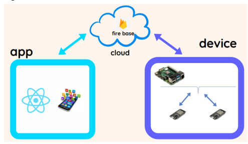
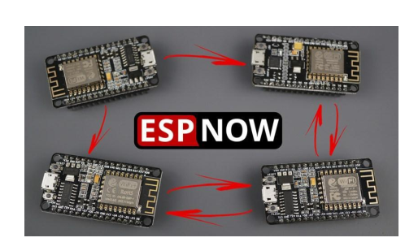
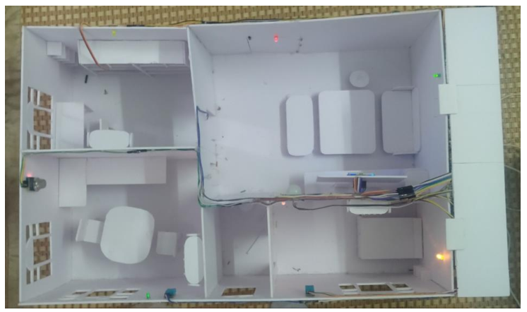

# IOT OnePiece

## Introduction
Smart Home is an intelligent automation system within a house that allows control and
management of various devices and systems such as lighting, air conditioning, doors,
security systems, audio, video, and other household appliances. This system is controlled
through smart mobile devices or voice commands, helping users save time, increase
convenience, and enhance safety in their daily lives. 
Providing a general overview of the accomplished content:
- Communication between sensors and ESP8266 and ESP32
- Pushing the collected data to Firebase
- Creating a React Native app to control devices within the Smart Home
- Facial recognition for door unlocking
- Implementing ESP NOW communication between 4 ESP devices
- Over-the-air (OTA) firmware updates
## System Construction
The system structure consists of three components: Cloud, App and Device, as depicted
in the diagram below.:

1. Device
   Implement ESP NOW communication between 4 esp

   ESP-NOW, developed by Espressif, is a communication protocol designed for efficient
short-packet transmission. It enables multiple devices to communicate without relying on
Wi-Fi, functioning on a low-power 2.4GHz wireless connection. Initial pairing is
required for secure peer-to-peer communication. Once paired, the connection remains
persistent, even if a device reboots or loses power, ensuring seamless data exchange.

3. Cloud
   We used Firebase real time to upload data into cloud:  
   - Communication of DHT11 temperature and humidity sensor with ESP8266 and data
   pushing to Firebase
   - Communication of MQ2 gas sensor with ESP8266 and data pushing to Firebase
   - Communication of PIR (HC-SR501) motion detection sensor with ESP8266 and
   data pushing to Firebase

4. App
   React Native is an open-source framework for building mobile applications using JavaScript and React. Developed by Facebook, it enables developers to create native apps for both iOS and Android platforms from a single codebase. React Native utilizes a declarative programming model, allowing developers to describe the UI based on the application state. It supports hot reloading, providing instant feedback on code changes. The framework offers a rich ecosystem of third-party libraries and tools for navigation, data management, and state management. Overall, React Native provides a powerful solution for cross-platform mobile development, combining performance, productivity, and developer experience.

5. [Go to detail](https://github.com/hieu2k2boss/IOT_OnePiece/blob/main/Doc_SmartHome_Team-One-Piece.pdf)
## Install

### Requirement
   - Hardware devices: DHT11, MQ2, Servo, LED, 4 ESP8266, etc.
   - python >=3.6
   - react native >= 0.73
## How to run project 
1. Device

2. App

   Please access here for detailed instructions on how to run our IoT app. [here](https://github.com/hieu2k2boss/IOT_OnePiece/blob/main/Code%20APP/SmartHome-main/README.md)
3. Additional feature: Facial recognition for door unlocking.

   
## Demo

   Video demo results of pushing data to cloud firebase [here](https://www.facebook.com/100008664642659/videos/1041798010151511/)

## References

## Conclusion
   While participating in the IoT challenge, we successfully executed the Smart Home
project. This encompassed acquiring expertise in connecting ESPs through the ESPNOW protocol, establishing ESP connections to Firebase Cloud, performing read and
write operations for sensor data, facilitating push and pull interactions with Firebase,
controlling devices through a React Native app, and implementing facial recognition to
unlock doors.

If you have any questions or suggestions, please feel free to contact us at hieu2k2boss@gmail.com. We welcome your feedback and contributions to improve the Send-Mail backend application.

Thank you for using and exploring the application!
